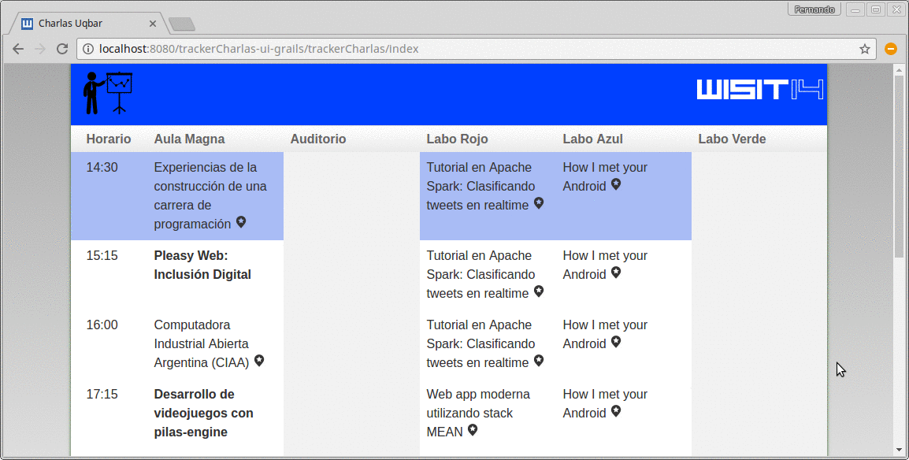

# Tracker de Charlas de Grails

   
   </img>
   
   </img>

## Explicación

Para el [WISIT'14](http://www.uqbar-project.org/events/wisit-2014) se organizó un taller de Grails donde se desarrolló una aplicación que mostrara las charlas 
que se estaban dando en cada una de las aulas. Este proyecto resume el taller en estado final.

## Versiones actuales

* Grails 2.4.2
* en un entorno GGTS 3.6.0
* con Twitter Boostrap 3.2.0

# Branches

* **fresh**: es la versión inicial para comenzar el taller
* **master**: es la versión final
